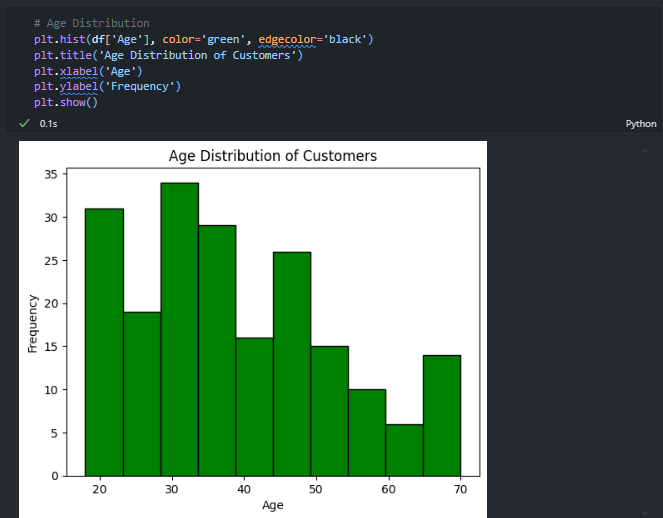

# Customer Demographics and Spending Behavior Analysis

- **Data:** [Mall Customer Segmentation Data](https://www.kaggle.com/datasets/vjchoudhary7/customer-segmentation-tutorial-in-python)
- **Software Used:** Python, Jupyter Notebook
- **Python Modules Used:** Pandas, NumPy, Matplotlib
- **Purpose:** This project aims to explores customer demographics and spending behavior.
- **Description:** The analysis includes insights into age, income, gender differences, and spending patterns, with visualizations to support business-driven decisions.

# Goals
- Understand Customer Demographics.
- Explore how customer income correlates with their spending score.
- Analyze spending behavior and income across different age groups
- Identify any significant differences between genders and provide insights.
- Identify the top 20% of customers based on their spending score and analyze their demographics (age, income, gender).
- Identify which demographic (age/gender) tends to spend the most and which tends to spend the least.

# Intro
To set up the project, I downloaded the data from kaggle, imported the modules I was going to need, then imported the data.

To ensure that the data is correctly interpreted and processed by my analysis, I check the datatypes using the code below.

Missing data can lead to biased or inaccurate analysis results. If you ignore missing values, you might be making incorrect inferences from your data, so I check for missing data. In this case, there was no missing data, but if there was, we could fill the data with the average of the column, or delete the rows with blanks.

# Analysis
To get a basic understanding of the data, we will calculate the summary statistics.

From these statistics, we can get some valuable information. 

For age, we know the average age for this customer sample is 39 (after rounding), and the ages of customers sampled range from 18 to 70. We know 25% of the customers in the sample are under 29, 50% under 36, 75% under 49, and 25% over 49 years old. 

For annual income, we know the average annual income for this customer sample is around $61,000 (after rounding), and the annual income of customers sampled range from $15,000 to $137,000. We know 25% of the customers in the sample have an annual income of $41,500, 50% under $61,500, 75% under $78,000, and 25% over an annual income of $78,000. 

This information helps us understand our customer demographic.

I graphed the age distribution using a histogram to easily identify trends, and it seems the sample data shows the mall seems to have a younger demographic. With this, we can attempt to tailor promotions and offers to these younger groups who are likely to spend more.

I was curious if age affected the spending score, so I plotted a scatterplot and calculated the correlation coefficient to determine if there was any correlation.

The graph shows a subtle negative correlation, and the correlation coefficient of -.33 supports that. There seems to be a weak negative correlation between age and spending score. This subtly hints that as age increases, the customer spends less at the mall.

I also plotted a scatterplot to determine if there seemed to be a correlation between annual income and spending score. There seemed to be no correlation with a correlation coefficient of about 0.01 to support that. This signifies that high-income spenders are not spending as much as expected. With that knowledge, we can look to create premium products or offer personal recommendations or VIP programs targeted at these customers to attempt to get them to spend more.

I added code to create age groups to simplify the data.

After graphing these age buckets, we can see the highest spenders tend to be between the age of 26 and 35. This should be the target demographic for promotions as this age group tends to spend more, or we should look to evaluate why older customers spend less and look to find a way to target them to spend more.

To compare gender spending habits, I grouped annual income and spending score by gender to evaluate.

I plotted the average income and spending score by gender to compare. It seems, on average, men have a higher annual income in the sample, but women tend to spend more. It should be evaluated why men are spending less while making more and see if we can get them to spend more money and/or lean into targeting women with promotions and offer as they tend to spend more. Are there not enough items men would want to buy? Are the stores in the mall mostly women stores?

Somthing else to lean in to could be to focus on the top 20% of customers. I created a filter to filter the data to only the top 20% of customers based on spending and calculated the summary statistics once more and plotted the distribution. It seems there are nobody above the age of 40 in the top spenders, so we should look to market to people below 40 years old.

To compare gender and spending score of the top 20%, I plotted box and whisker plots next to each other. It seems for the top 20% of spenders seems to be no significant differences between men and women. The top spenders by age remain the 26-35 age group.

# Conclustion
It seems the sample data shows the mall seems to have a younger demographic. With this, we can attempt to tailor promotions and offers to these younger groups who are likely to spend more. There seemed to be no correlation with a correlation coefficient of about 0.01 to support that. This signifies that high-income spenders are not spending as much as expected. With that knowledge, we can look to create premium products or offer personal recommendations or VIP programs targeted at these customers to attempt to get them to spend more. The highest spenders tend to be between the age of 26 and 35. This should be the target demographic for promotions as this age group tends to spend more, or we should look to evaluate why older customers spend less and look to find a way to target them to spend more. It seems, on average, men have a higher annual income in the sample, but women tend to spend more. It should be evaluated why men are spending less while making more and see if we can get them to spend more money and/or lean into targeting women with promotions and offer as they tend to spend more. Somthing else to lean in to could be to focus on the top 20% of customers. The demographic seems to be the same, but we can look to offer loyalty or rewards programs and targeted marketing toward this group.
